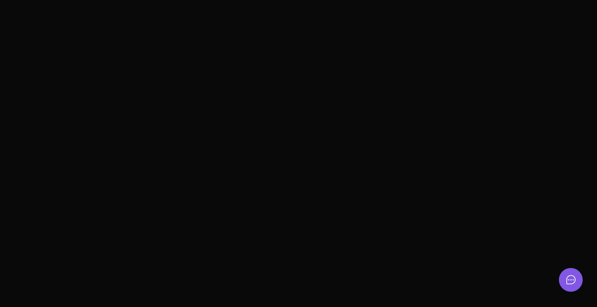

<p align="center">
  
</p>

<h1 align="center">
    
</h1>

<br>

## About this widget

In this widget, it is possible to you send a feedback about the app, you can taking screenshot of current window and choose a type of feedback.

<br>

Some features of the app (web): 💻



<br>

Routes of the backend (server): 📄

[POST] /feedbacks 

In this route it is possible to create a new feedback.

Coming soon, documentation with Swagger.

## How to running the project locally 🔨

1. Clone this repository into your machine:

```bash
git clone https://github.com/mhvalente99/nlw-return.git
```

2. With the repository cloned, firstly open the root dir in your terminal and run the commands:

```bash
cd server
```

3. Now install the dependencies and start application:

```bash
npm install

npm run dev
```

> The app is running in http://localhost:3333

4. After server is running, let's run the widget app:

```bash
cd web
```

5. Now install the dependencies and start application:

```bash
npm install

npm run dev
```

> The app is running in http://localhost:3000

## Tests (server) 🧪

Were implemented unit test for use case send feedback

How to run unit test:

```bash
npm run test
```

## Layout 🔖

Can you see the project layout in this link:

https://www.figma.com/community/file/1102912516166573468/Feedback-Widget

## Tech 👨🏻‍💻


## Packages/Plugins 📟
 
1. Server

  
    
  
  
  

2. Web
  
  
  Vite
  
## Next Steps 🤘🏻

# Web

  - [ ] Screenshot without widget
  - [ ] Autoclose widget after send feedback
  - [ ] Create mail template
  - [ ] Treatment errors and exceptions
  - [ ] Dark/Light theme
  - [ ] Input data validation

# Server
  
  - [ ] Create documentation with swagger
  - [ ] Integration tests
  - [ ] Change database provider to Postgres

## Contributors 🚀

<table>
  <tr>
    <td align="center"><br /><sub><b>Matheus Valente</b></sub></a><br /><a href="https://www.linkedin.com/in/matheus-valente-987634119/"title="Code">💻</a></td></td>
</table>
